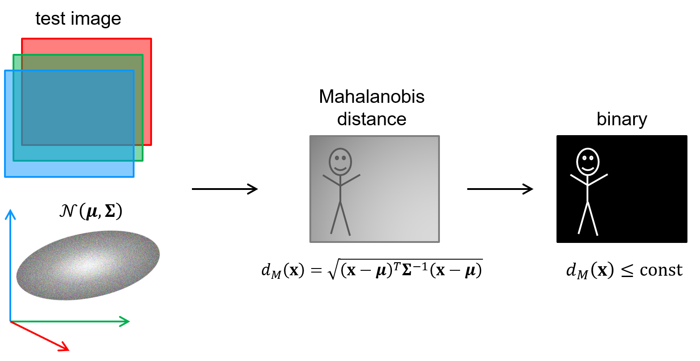

# Step 1: Get an overview
Today we will implement and experiment with a simple segmentation method based on colour.
You can choose to work on images from your camera or on the provided [videos captured from an autonomous vehicle](../README.md).

We will begin by using the measured colour ([B,G,R] in OpenCV) as a 3-dimensional *feature vector* for each pixel.
Pixels with similar colours should be distributed in the same region of the 3-dimensional feature space.
We can represent this distribution by training a *multivariate normal model* on feature samples.
This allows us to measure how well new samples fit with this distribution by computing the *Mahalanobis distance*.

Doing so for all pixels in an image gives us an image of Mahalanobis distances between each pixel and the feature model.
By thresholding the Mahalanobis distance image we get a binary image indicating segments of pixels that are sufficiently similar to the training samples.

This is a simplistic approach, but the method can naturally be generalised and improved:

- We can transform the colours to another, better suited colour space.
- Each pixel can be represented with more features than just colour.
- The set of pixels that we want to segment out might not fit well with a multivariate normal distribution, so we can
  use a more flexible distribution instead.

  
## Main steps in this lab
1. **Estimate a multivariate normal distribution** by training on the feature samples in a predefined sample region.

2. **Compute Mahalanobis images** by calculating the Mahalanobis distance between each pixel and the model.

3. **Detect similar pixels** by thresholding the Mahalanobis image.
   The final binary image is the result of our segmentation method.

4. We will also implement **an adaptive segmentation procedure**, that gradually updates the model based on how the pixels in the sampling region change over time.

## Introduction to the project source files
We have chosen to distribute the code on the following files:
- _lab-segmentation.{h,cpp}_

  Contains the main loop of the program, and several utility functions.

  Note in particular that:
  - Keypress `space` samples pixels from the sampling region and estimates the multivariate normal model
  - Keypress `o` turns thresholding by Otsu's method on/off (Default is off)
  - Keypress `a` turns the adaptive model on/off (Default is off)
  - Keypress `q` exits the program
  
  If you want to work on images from one of the videos instead of from the camera, you can change to code from 
  `cv::VideoCapture cap{0}` to `cv::VideoCapture cap{"your_video_path.avi"}`.

- _multivariate_normal_model.{h,cpp}_

  Contains the definition of the class `MultivariateNormalModel`.
  
  You will implement several methods in this class.

- _main.cpp_

  Starts the lab, catches any exceptions and prints their error message on the console.
  
  
  Please continue to the [next step](2-implement-simple-color-based-segmentation.md).